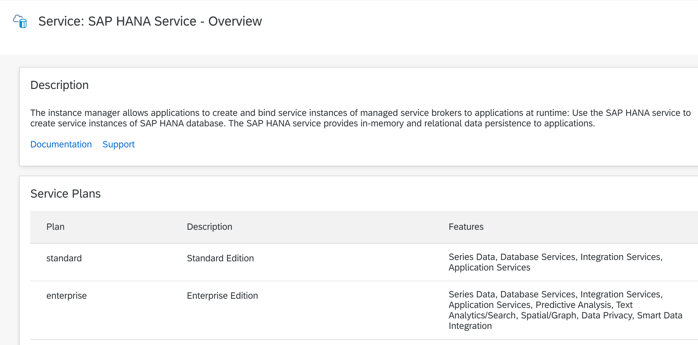
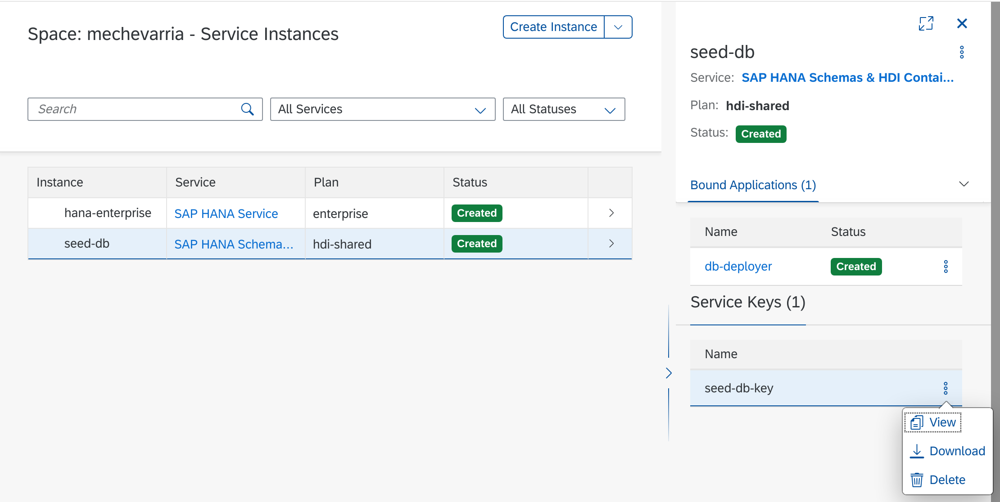

# seed-hdi

Deploys an empty [HDI Container](https://help.sap.com/viewer/4505d0bdaf4948449b7f7379d24d0f0d/2.0.03/en-US/1ca64155ec5a465294e0d8b10383cea8.html) to [SAP Cloud Platform](https://www.sap.com/products/cloud-platform.html). A seed project to start SAP HANA development locally or in [SAP Business Application Studio](https://help.sap.com/viewer/product/SAP%20Business%20Application%20Studio/Cloud/en-US)

## Requirements

* An account on SAP Cloud Platform _Free Trial available for up to 90 days_
* An enterprise instance of the SAP HANA Database service



* The [Cloud Foundry cli](https://docs.cloudfoundry.org/cf-cli/install-go-cli.html) for local development

* [Setup SAP Business Application Studio](https://developers.sap.com/tutorials/appstudio-onboarding.html) for online development

## Deploy

* Make sure you are logged into your SAP Cloud Platform space by running

```bash
./cf-login.sh
```

* The script assumes your platform credentials are available as environment variables. Place in **${HOME}/.profile** or ****${HOME}/.bashrc**

```bash
export CP_USER=i111222
export CP_PASSWORD=SapCloudPlatformPassword
```

* Adjust the **org** and **space** values for your account

* Create and deploy the container with
```bash
./cf-db.sh
```

## Access the database

* Get the access configuration from the service keys section of the instance in the cockpit or with the `cli` with the following command

```bash
cf service-key seed-db seed-db-key
```


